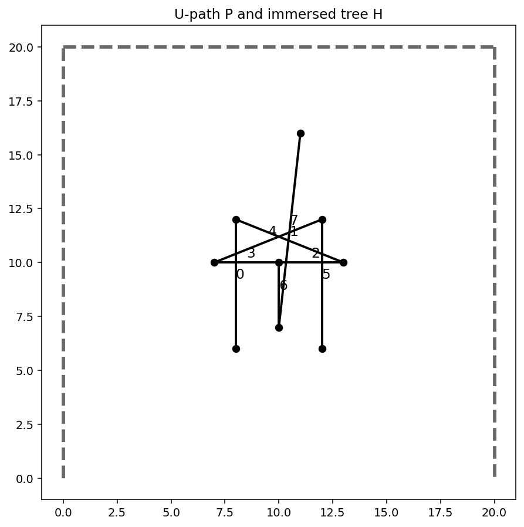
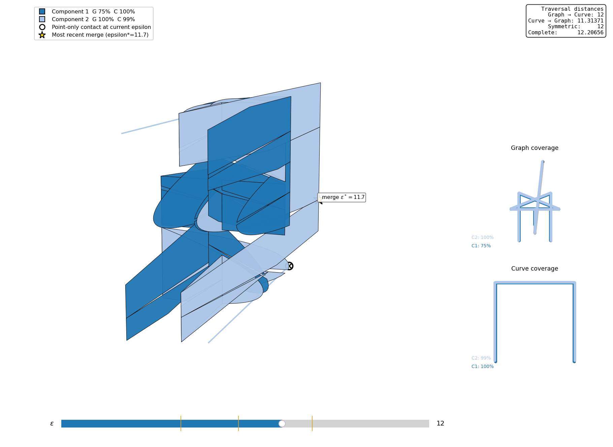
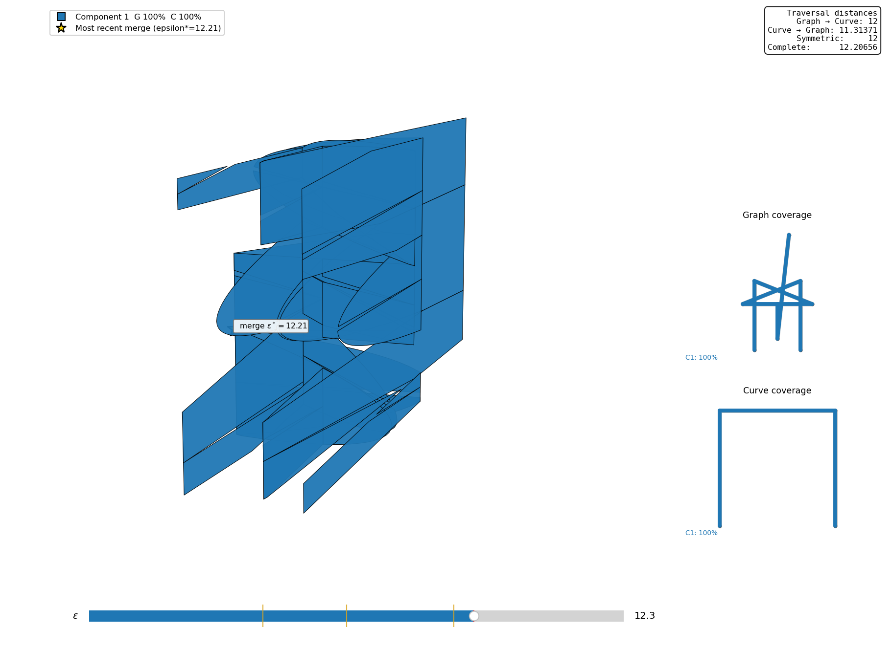

# Traversal Distance Python Library

Compute and explore traversal distances between two geometric graphs with straight-line edges.

The library provides three capabilities:

- **Distance computation:** compute both directed traversal distances, their symmetric maximum, and the complete traversal distance through a Python API or a command-line tool.
- **Decisions at a specified epsilon:** test whether either directed distance, the symmetric distance, or the complete distance is at most a chosen threshold.
- **Visualization:** plot the input graphs with shaded polygons constructed from free-space boundary intervals, select edge pairs to display, and record the computation in log files.

Use `compute_traversal_distances` or `traversal-distances` to obtain the four distance values. Use `traversal_decisions` for threshold tests. The command `python3 main.py G H EPSILON` runs a threshold computation and opens a plot.

## Installation

The code can be run directly from a checkout using Python 3.9 or later. For the distance computations, install NumPy:

```bash
python3 -m pip install numpy
```

The plotting program also uses Matplotlib and GeoJSON:

```bash
python3 -m pip install matplotlib geojson
```

Optionally, install the repository as an editable Python package:

```bash
python3 -m pip install -e .
```

This makes `traversal_distance` importable from other working directories and installs the `traversal-distances` command-line command. Changes made in the checkout are used immediately because the installation is editable.

## Quick start: U-path and immersed tree

Let $P$ be a U-shaped path and $H$ an immersed tree. The runnable example is [`examples/u_path_immersed_tree.py`](examples/u_path_immersed_tree.py), and the regression test in `tests/test_distances.py` uses the same graph-construction function.



*The dashed curve is P and the solid tree is H. Geometric crossings of tree edges do not introduce additional vertices.*

Run the example from the repository root:

```bash
python3 -m examples.u_path_immersed_tree
```

The example file is:

```python
"""U-path / immersed-tree example used in the README and regression tests."""

from traversal_distance import Graph, compute_traversal_distances, traversal_decisions


def make_u_path_immersed_tree():
    """Return the U-shaped path P and immersed tree H from the README example."""
    P = Graph.from_data(
        {0: (0, 0), 1: (0, 20), 2: (20, 20), 3: (20, 0)},
        {0: (0, 1), 1: (1, 2), 2: (2, 3)},
    )
    H = Graph.from_data(
        {0: (8, 6), 1: (8, 12), 2: (13, 10), 3: (10, 10),
         4: (7, 10), 5: (12, 12), 6: (12, 6), 7: (10, 7), 8: (11, 16)},
        {0: (0, 1), 1: (1, 2), 2: (2, 3), 3: (3, 4),
         4: (4, 5), 5: (5, 6), 6: (3, 7), 7: (7, 8)},
    )
    return P, H


def main():
    P, H = make_u_path_immersed_tree()

    d = compute_traversal_distances(P, H, tolerance=1e-6)
    print(f"P -> H:   {d.first_to_second:.7g}")
    print(f"H -> P:   {d.second_to_first:.7g}")
    print(f"Symmetric: {d.symmetric:.7g}")
    print(f"Complete:  {d.complete:.7g}")
    print("At epsilon 12:  ", traversal_decisions(P, H, 12.0))
    print("At epsilon 12.3:", traversal_decisions(P, H, 12.3))


if __name__ == "__main__":
    main()
```

Output:

```text
P -> H:   11.31371
H -> P:   12
Symmetric: 12
Complete:  12.20656
At epsilon 12:   (True, True, False)
At epsilon 12.3: (True, True, True)
```

These approximate the values $8\sqrt{2}$, $12$, $12$, and $\sqrt{149}$, respectively. Both directed conditions hold at $\varepsilon=12$, but they are satisfied by different connected components. Neither component covers both inputs, so the complete condition fails.

`traversal_decisions` returns the two directed decisions and the complete decision, in that order. The symmetric decision is the conjunction of the two directed decisions.

The fields `first_to_second` and `second_to_first` follow the order of the arguments to `compute_traversal_distances`. The result also provides `tolerance` and `as_dict()`.

To read graphs from files instead, use `Graph("PATH/NAME")`; the [input format](#input-format-and-samples) is described below.

## Distance definitions

Let $G$ and $H$ be finite, connected graphs with straight-line edges, with drawings $\phi_G:G\to\mathbb{R}^2$ and $\phi_H:H\to\mathbb{R}^2$.

A **traversal** of a graph is a continuous map from $[0,1]$ onto the entire graph, including every edge interior. A **partial traversal** is continuous but need not cover the entire graph. Traversals may pause, backtrack, and revisit edges; their starting and ending points are unrestricted.

### Directed and complete distances

Both distances minimize the same maximum separation:

$$
\inf_{\tau,\sigma}\;\max_{t\in[0,1]}
\left\lVert\phi_G(\tau(t))-\phi_H(\sigma(t))\right\rVert_2.
$$

Here $\tau:[0,1]\to G$ and $\sigma:[0,1]\to H$ are continuous. Only the coverage requirements differ:

| Distance | Requirement on $\tau$ | Requirement on $\sigma$ |
| --- | --- | --- |
| $\vec{d}_T(G,H)$ | Covers all of $G$. | May cover only part of $H$. |
| $\vec{d}_T(H,G)$ | May cover only part of $G$. | Covers all of $H$. |
| $d_{\mathrm{comp}}(G,H)$ | Covers all of $G$. | Covers all of $H$. |

Thus the complete distance imposes full coverage on both maps in one paired traversal. This symmetric variant was introduced by Maike Buchin and Lea Thiel in *Comparison of Graph Distance Measures* (CG:YRF 2024), where it is denoted $\delta_{cT}$; see [Buchin and Thiel (2024)](#references). The two directed distances need not be equal.

### Symmetric distance

The symmetric traversal distance is the maximum of the two directed distances:

$$
d_{\mathrm{sym}}(G,H)=\max\left\{\vec{d}_T(G,H),\vec{d}_T(H,G)\right\}.
$$

Each directed distance can use a different paired traversal. Complete traversal requires a single pair covering both inputs, so

$$
d_{\mathrm{sym}}(G,H)\leq d_{\mathrm{comp}}(G,H).
$$

The [U-path/tree example](#quick-start-u-path-and-immersed-tree) above illustrates strict inequality.

### Immersed graphs and crossings

Connectivity is determined by vertex IDs. A geometric crossing is a graph vertex only when the intersecting edges are split there and use a shared vertex ID. Otherwise, the crossing has distinct preimages in the abstract graph, and a traversal cannot switch between the crossing edges there. Distinct vertices with identical coordinates likewise remain distinct.

Edges are undirected. The order of an edge's endpoints specifies its parameterization, not a permitted direction of travel.

### Free-space characterization

For a threshold $\varepsilon$, define

$$
F_\varepsilon(G,H)=\left\{(x,y)\in G\times H:
\left\lVert\phi_G(x)-\phi_H(y)\right\rVert_2\leq\varepsilon\right\}.
$$

Each distance is at most $\varepsilon$ precisely under the corresponding coverage condition:

| | Required coverage by connected components of $F_\varepsilon$ |
| --- | --- |
| $\vec{d}_T(G,H)\leq\varepsilon$ | Some component projects onto all of $G$. |
| $\vec{d}_T(H,G)\leq\varepsilon$ | Some component projects onto all of $H$. |
| $d_{\mathrm{sym}}(G,H)\leq\varepsilon$ | Both directed conditions hold, possibly in different components. |
| $d_{\mathrm{comp}}(G,H)\leq\varepsilon$ | One component projects onto both $G$ and $H$. |

Free space within each edge-pair cell is convex. Cells connect through feasible shared vertex-edge boundaries, including boundaries consisting of a single point. Coverage includes edge interiors, not just vertices.

## How the distances are computed

`traversal_decisions(G, H, epsilon)` checks the free-space conditions above. It determines which edge-pair cells are nonempty, connects them through feasible shared boundaries, and combines the projection intervals within each connected component. The component must cover every edge of the required graph.

`compute_traversal_distances(G, H)` finds the smallest feasible threshold by **bisection**. It keeps an interval whose lower end fails the relevant coverage test and whose upper end passes it, tests the midpoint, and retains the appropriate half. It performs this search for both directed distances and the complete distance, then takes the maximum of the two directed values for the symmetric distance.

The `tolerance` argument specifies the target width of the search interval in coordinate units; its default is `1e-6`. The function returns the passing upper endpoint. The API also accepts `max_iterations`, with a default of 80, as a limit on each search. The reported distance values are decimal approximations obtained by this search, rather than symbolic critical values.

## Command line

### Compute all four distances

After installation:

```bash
traversal-distances GRAPH1_PREFIX GRAPH2_PREFIX
```

Or use the repository entry point:

```bash
python3 distance_main.py GRAPH1_PREFIX GRAPH2_PREFIX --tolerance 1e-6
```

The output lists the two directed values in input order, followed by the symmetric and complete distances.

### Compute and plot at a specified epsilon

```bash
python3 main.py GRAPH1_PREFIX GRAPH2_PREFIX EPSILON
```

This command takes a threshold as input, runs a depth-first-search and projection check, and opens a plot of the graphs with shaded polygons constructed from free-space boundary intervals. Its console output reports the threshold, graph sizes, computation statistics, and projection-check result. It does not search for the four distance values; use `traversal-distances` for those values or `traversal_decisions` for all threshold tests.

For example:

```bash
python3 main.py samples/athens/groundtruth samples/athens/kevin 300.0 -p
```


*Input graphs with shaded polygons constructed from free-space boundary intervals at a specified epsilon.*


*Console output from the threshold computation.*

The plot opens by default; `-p` is accepted but is not needed to enable it. Use `-l` to write logs; create the `logs/` directory before running the command:

```bash
mkdir -p logs
python3 main.py samples/paris/arc_de_triomphe samples/paris/vehicle 5 -l
```

To restrict the shaded polygons to selected edge pairs, supply both `-g1_ids` and `-g2_ids`:

```bash
python3 main.py samples/paris/arc_de_triomphe samples/paris/vehicle 5 -g1_ids 0 -g2_ids 0,1,2
```

These options select edges for the shaded overlay; they do not restrict the graphs used in the computation.

## Input format and samples

A prefix `NAME` refers to two comma-separated files without a header:

```text
NAME_vertices.txt    vertex_id,x,y
NAME_edges.txt       edge_id,start_vertex_id,end_vertex_id
```

Each edge joins the two listed vertex IDs. Coordinates and distances use a common Euclidean coordinate system and common units.

The repository includes these sample pairs:

| Location | First graph prefix | Second graph prefix |
| --- | --- | --- |
| Paris | `samples/paris/arc_de_triomphe` | `samples/paris/vehicle` |
| Athens | `samples/athens/groundtruth` | `samples/athens/kevin` |
| Chicago | `samples/chicago/groundtruth` | `samples/chicago/james` |

For example:

```bash
python3 distance_main.py samples/paris/arc_de_triomphe samples/paris/vehicle
```

The Paris graph is disconnected as stored. No continuous traversal can cover all of it, so the distance API reports infinity for the first-to-second, symmetric, and complete distances in this example. The U-path/tree example has finite values for all four distances.

## Free-space components and coverage

The following figures use [FSDvis](https://github.com/compgeomTU/FSDvis) to display the graph-versus-curve free space for the U-path/tree pair above.



*At epsilon 12, Component 1 covers P and Component 2 covers H; neither covers both. In this view the graph input is H and the curve input is P, so the distance panel's two directed labels appear in the reverse order from the Python call above.*



*At epsilon 12.3, one component covers both inputs. The distance panel reports the same four distances in both figures: changing epsilon changes the displayed free space, not the input pair or its distances.*

## Interactive free-space visualization

[FSDvis](https://github.com/compgeomTU/FSDvis) provides graph-versus-curve free-space diagrams with connected-component colors, an epsilon slider, projection coverage, critical contacts, and displayed traversal distances. It can use this library to compute the displayed values.

The distance API accepts graph-versus-graph inputs. FSDvis visualizes graph-versus-curve inputs, including the U-path/tree pair above.

## Authors

| Author | Project affiliation | Contact / website |
| --- | --- | --- |
| Dr. Carola Wenk | Tulane University | [cwenk@tulane.edu](mailto:cwenk@tulane.edu) |
| Erfan Hosseini Sereshgi | Tulane University | [shosseinisereshgi@tulane.edu](mailto:shosseinisereshgi@tulane.edu) |
| Will Rodman | Tulane University | [wrodman@tulane.edu](mailto:wrodman@tulane.edu) |
| Rena Repenning | Morgan Stanley | [renarepenning.com](http://renarepenning.com) |
| Emily Powers | Tulane University | [epowers3@tulane.edu](mailto:epowers3@tulane.edu) |

## References

- H. Alt, A. Efrat, G. Rote, and C. Wenk. **Matching planar maps.** *Journal of Algorithms* 49(2):262–283, November 2003. [DOI: 10.1016/S0196-6774(03)00085-3](https://doi.org/10.1016/S0196-6774(03)00085-3).
- M. Buchin and L. Thiel. **Comparison of Graph Distance Measures.** *Computational Geometry: Young Researchers Forum (CG:YRF 2024), Booklet of Abstracts*, pp. 55–57, 2024. [Booklet PDF](https://socg24.athenarc.gr/proceedings/YRF24%20booklet.pdf).

## License

[MIT License](https://github.com/compgeomTU/traversalDistance/blob/main/LICENSE) • Copyright (c) 2022 Computational Geometry @ Tulane.
